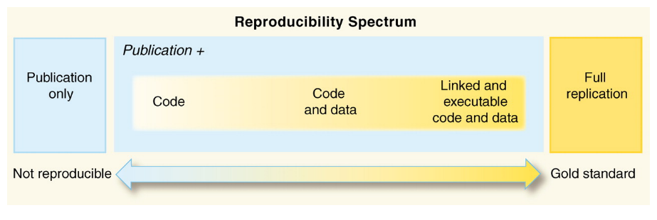

```{r setup, include=FALSE}
options(htmltools.dir.version = FALSE)
```


class: middle

**reproducible research** is the ability to recompute data analytic results, given an observed data set and knowledge of the data analysis pipeline.

.footnote[Peng 2015 [*The reproducibility crisis in science: A statistical counterattack*](https://doi.org/10.1111/j.1740-9713.2015.00827.x)]

???

# reproducible research


---
class: middle, inverse

Replicating studies remains the gold standard for rigorous scientific research, but reproducibility is increasingly viewed as a *minimum standard* that all scientists should strive toward.

.footnote[Alson and Rick 2021 [*A Beginner's Guide to Conducting Reproducible Research*](https://doi.org/10.1002/bes2.1801)]


???

# minimum standard

---
class: center, middle

</img>

.left-footnote[Peng 2011 [*Reproducible Research in Computational Science*](10.1126/science.1213847)]

???

# reproducibility spectrum

- including the code is important because it documents the decision-making process Powers and Hampton 2019


---
class: middle

**reproducibility for scientific reasons**

* increased trustworthiness
* more rigorous, reliable science
* learning more from one another's work

  
.footnote[Thompson 2018 [*The Life & Times of a Reproducible Clinical Project in R*](https://bit.ly/jlt-rmed2018)]

???

# reproducibility for scientific reasons

---
class: middle

**reproducibility for personal reasons**

- helps researchers remember how and why they did *x*
- enables researchers to quickly and simply modify figures, tables, etc.
- enables quick reconfiguration of previously conducted research tasks

  
.footnote[Alson and Rick 2021 [*A Beginner's Guide to Conducting Reproducible Research*](https://doi.org/10.1002/bes2.1801)]

???

# reproducibility for personal reasons

---
class: inverse, middle

*basically, if the thought of redoing your analyses is terrifying then you are doing it wrong*  
<br>
J. Bryan

???

# redoing analyses

---
class: middle, center

# how?


---
class: middle

most basic principle for reproducible research is to **do everything via code**

* downloading data from the web
* converting an Excel file to CSV
* renaming columns or variables
* omitting bad samples or data points

*...do all of these programatically*

.footnote[Broman 2016 [*Steps toward reproducible research*](https://bit.ly/jsm2016)]

???

# everything by code


---
class: middle


**track your versions**  

Using version-control software such as Git and GitHub, researchers can document and share the precise version of the tools that they use, and retrieve specific versions as necessary.

<br>

.center[</img>]

.footnote[Perkel 2018 [*A toolkit for data transparency takes shape*](https://doi.org/10.1038/d41586-018-05990-5)]

???

# version control


---
class: middle

**replicate your environment**  

Containers are standalone, portable environments that contain the entire computing environment used in an analysis: software, all of its dependencies, libraries, binaries, and configuration files, all bundled into one package. Containers can then be archived or shared, allowing them to be used in the future, even as packages, functions, or libraries change over time.

<br>

.center[</img>]

.footnote[Alson and Rick 2021 [*A Beginner's Guide to Conducting Reproducible Research*](https://doi.org/10.1002/bes2.1801)]

???

# containers


---
background-image: url(assets/figures/gitlab_docker_data.png)
background-position: 50% 50%
background-size: 80%


???

# git_docker_data


---
class: middle, inverse

*It's not thinking, 'This is easiest for myself right now.' It's thinking, 'When I'm working on this next week, next month, right before I graduate — how do I set myself up so that it’s easier later?'*  
<br>
J. Lowndes


.footnote[Perkel 2018 [*A toolkit for data transparency takes shape*](https://doi.org/10.1038/d41586-018-05990-5)]

???

# thinking ahead


---
class: middle

...back to the data

Borrowing an economics term, Leonelli (2015)<sup>1</sup> refers to transferable research data as "fungible objects" defined by "their portability and their prospective usefulness as evidence" (p. 810)<sup>2</sup>


.footnote[
[1] Leonelli 2015 [*What counts as scientific data? A relational framework*](https://doi.org/10.1086/684083)  
[2] Pasquetto et al. 2019 [*Uses and Reuses of Scientific Data: The Data Creators' Advantage*](https://doi.org/10.1162/99608f92.fc14bf2d)
]

???

# data as fungible objects


---
background-image: url('assets/figures/fair.png')
background-size: 80%

.footnote[Wilkinson et al. 2016 [*The FAIR Guiding Principles for scientific data management and stewardship*](https://doi.org/10.1038/sdata.2016.18)]

???

# FAIR


---
class: middle

a call to action: **cite the data**

*Baker, S. and A. Davidson. 2021. Gunnison's Prairie Dog Restoration Experiment (GPDREx): Vegetation Cover Data from the Sevilleta National Wildlife Refuge, New Mexico (2011-2016) ver 226096. Environmental Data Initiative. https://doi.org/10.6073/pasta/696c2d207b59556dd39d44eb656dda23*


???

# cite the data
